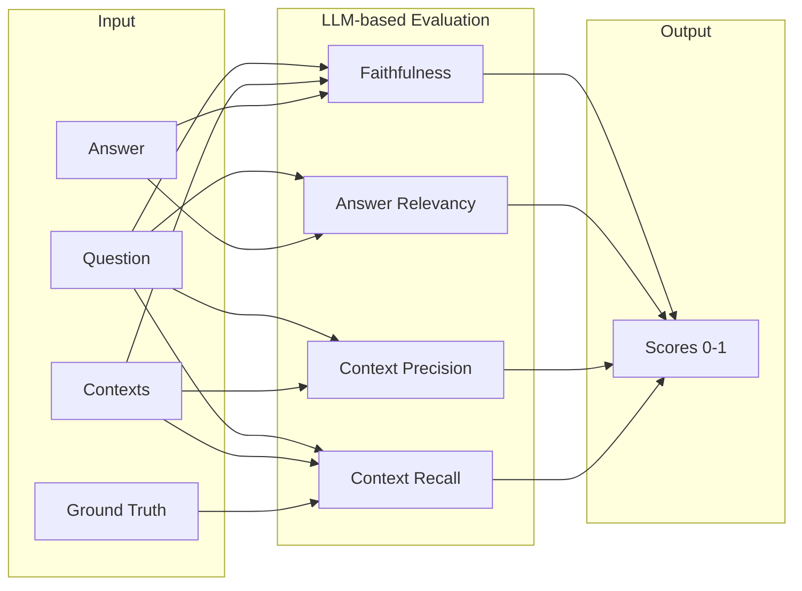

# RAGAS

RAGパイプラインの評価フレームワーク。

## 本質

Retrieval Augmented Generation (RAG) パイプラインの性能を、グラウンドトゥルースなしでも評価可能にする仕組み。LLM駆動メトリクスと体系的な実験を組み合わせ、継続的改善ループを実現。

## メカニズム



**評価フロー**: LLMがプロンプトフローを通じて各メトリクスを計算。人間の評価を模倣する形式で、複雑なタスクをサブタスクに分解して精度を向上。

## メトリクス

### RAG メトリクス

| メトリクス | 入力 | 測定対象 |
|-----------|------|----------|
| **Faithfulness** | question, contexts, answer | 回答がコンテキストに基づいているか |
| **Answer Relevancy** | question, answer | 回答が質問に関連しているか |
| **Context Precision** | question, contexts, ground_truth | 取得コンテキストの精度 |
| **Context Recall** | question, contexts, ground_truth | 必要情報の取得率 |

### Agent メトリクス

| メトリクス | 測定対象 |
|-----------|----------|
| Tool Call Accuracy | ツール呼び出しの正確性 |
| Agent Goal Accuracy | 目標達成度 |
| Topic Adherence | トピック一貫性 |

## 使い方

```bash
pip install ragas
```

```python
from ragas import evaluate
from ragas.metrics import faithfulness, answer_relevancy
from datasets import Dataset

data = {
    "question": ["When was the company formed?"],
    "answer": ["The company was formed in 2020."],
    "contexts": [["The company was founded in 2020 by..."]],
    "ground_truth": ["2020"]
}
dataset = Dataset.from_dict(data)

results = evaluate(
    dataset=dataset,
    metrics=[faithfulness, answer_relevancy],
)
print(results)
```

## 設計原則

1. **Single-Aspect Focus**: 1メトリクス=1側面
2. **Interpretable**: 直感的で理解しやすい
3. **Prompt Flow**: サブタスク分解で精度向上
4. **Robustness**: Few-shotで頑健性確保
5. **Normalized**: スコア範囲0-1で統一

## 参照

- [公式ドキュメント](https://docs.ragas.io/)
- [利用可能メトリクス一覧](https://docs.ragas.io/en/stable/concepts/metrics/available_metrics/)
- [GitHub](https://github.com/explodinggradients/ragas)
