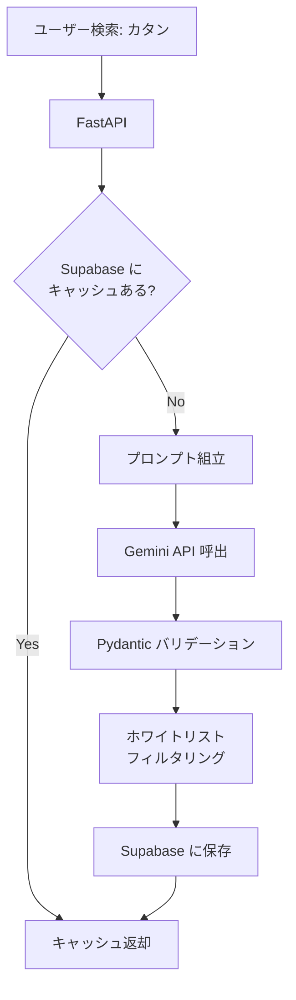
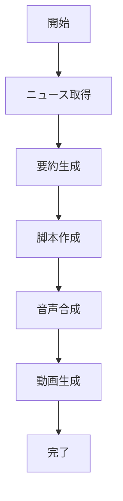
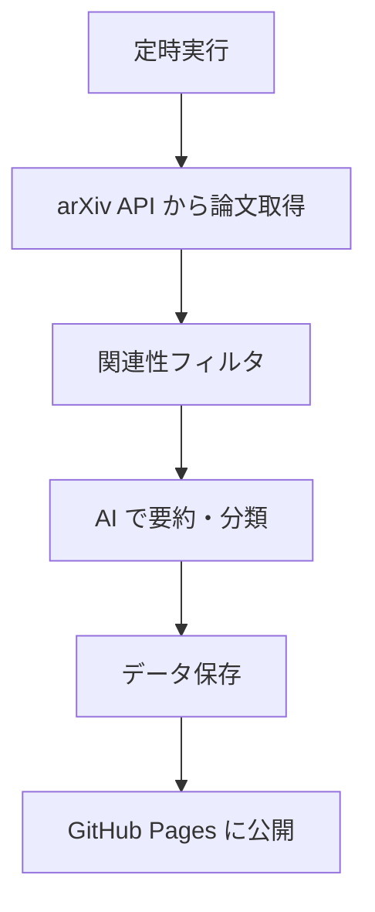

# AI パイプライン

AI を「単発の質問応答」ではなく「システムの部品」として組み込む技術。

## AI パイプラインとは


データが「パイプ（管）」を通るように、各ステップを順に流れる。

## パターン 1: リクエスト → AI → キャッシュ

`rule-scribe-games` のパターン。



### コードの流れ

```python
async def generate_metadata(query: str, context: str | None = None) -> dict[str, object]:
    # 1. コンテキスト準備
    if not context:
        rows = await supabase.search(query)
        context = "\n".join(...)

    # 2. プロンプト組立
    prompt = _load_prompt("metadata_generator.generate").format(query=query, context=context)

    # 3. AI 呼出
    result = await _gemini.generate_structured_json(prompt)

    # 4. バリデーション
    validated_data = GeneratedGameMetadata.model_validate(result)

    # 5. フィルタリング
    data = validated_data.model_dump()
    data = {k: v for k, v in data.items() if k in _ALLOWED_FIELDS}

    return data
```

**5段階のパイプライン**: コンテキスト → プロンプト → AI → バリデーション → フィルタ

## パターン 2: エージェントグラフ

`yt3` の LangGraph スタイル。AI が自律的にステップを判断する。

```python
async function main() {
    const store = new AssetStore(runId);
    const graph = createGraph(store);

    const inputs = {
        run_id: runId,
        bucket: bucket,
        limit: 3
    };

    const finalState = await graph.invoke(inputs);
}
```



### パイプラインとグラフの違い

| 特性 | パイプライン | エージェントグラフ |
|------|------------|-----------------|
| フロー | 固定（直線） | 動的（条件分岐あり） |
| 制御 | プログラマが決定 | AI が判断 |
| 複雑さ | 低い | 高い |
| デバッグ | 容易 | 困難 |

## パターン 3: バッチ処理

`daily-arXiv-ai-enhanced` のパターン。定期実行で大量データを処理。



**特徴**:

- 人間の介入なしで毎日実行
- 失敗しても翌日リトライ可能
- 結果は静的 HTML として公開

## プロンプト設計

AI パイプラインの品質はプロンプトで決まる。

### 構造化出力の指示

```
以下のボードゲームについて、JSON形式で情報を生成してください。

ゲーム名: {query}
参考情報: {context}

出力には以下のフィールドを含めてください:
- title: 英語タイトル
- title_ja: 日本語タイトル
- summary: 100文字以内の概要
- rules_content: ルールの全文
```

### プロンプトの管理

```python
def _load_prompt(key: str) -> str:
    data = PROMPTS
    for part in key.split("."):
        data = data[part]
    return str(data).strip()
```

プロンプトはコードにハードコードせず、設定ファイル（YAML）で管理する。

## 演習

### 問1: パイプラインを設計せよ

「ユーザーが画像をアップロードし、AI がキャプションを生成し、データベースに保存する」パイプラインを設計せよ。

??? note "解答"
    ```mermaid
    graph TD
        A["画像アップロード"] --> B["画像の保存(Storage)"]
        B --> C["AI キャプション生成"]
        C --> D["Pydantic バリデーション"]
        D --> E["DB に保存"]
        E --> F["レスポンス返却"]
    ```

### 問2: なぜバリデーションが必要か

AI の出力を直接データベースに保存せず、Pydantic で検証する理由を述べよ。

??? note "解答"
    - AI は指示通りの型で出力する保証がない（数値のはずが文字列になることがある）
    - 必須フィールドが欠落する可能性がある
    - 予期しないフィールドがセキュリティリスクになる（SQL インジェクション等）
    - Pydantic が「契約」として機能し、不正データの侵入を防ぐ

## チェックリスト

- [ ] パイプライン、エージェントグラフ、バッチ処理の違いを説明できる
- [ ] AI の出力にバリデーションが必要な理由を3つ挙げられる
- [ ] プロンプトをコードから分離する利点を理解している
- [ ] キャッシュ戦略がコスト削減に貢献する仕組みを説明できる
