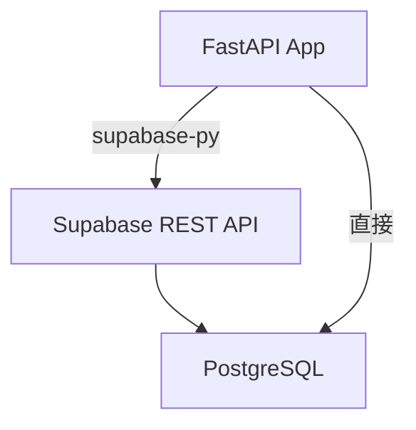
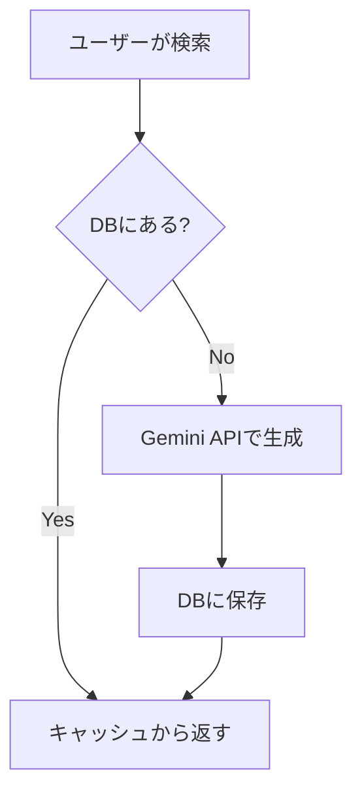

# データベースと SQL

データを永続化し、効率的に検索する仕組み。

## なぜデータベースが必要か

ファイル（JSON）とデータベースの比較:

| 特性 | JSON ファイル | データベース |
|------|-------------|-------------|
| 検索速度 | 全件走査 O(n) | インデックス O(log n) |
| 同時アクセス | 破損リスクあり | トランザクション保護 |
| データ量 | メモリに収まる範囲 | TB 級まで対応 |
| 構造の強制 | なし | スキーマで定義 |

## リレーショナルデータベース（RDB）

データを**テーブル（表）**として管理する。

### テーブルの構造

`rule-scribe-games` の `games` テーブルのイメージ:

| id | slug | title | title_ja | summary | view_count |
|----|------|-------|----------|---------|------------|
| 1 | catan | Catan | カタン | 資源を集めて... | 1523 |
| 2 | dominion | Dominion | ドミニオン | デッキ構築の... | 892 |
| 3 | splendor | Splendor | 宝石の煌き | 宝石を集めて... | 1105 |

- **行（row）**: 1つのゲームのデータ
- **列（column）**: データの属性（フィールド）
- **主キー（Primary Key）**: 各行を一意に識別する `id`

## SQL の基本

SQL（Structured Query Language）はデータベースと会話するための言語。

### CRUD 操作

| 操作 | SQL | HTTP メソッド |
|------|-----|-------------|
| **C**reate（作成） | `INSERT` | POST |
| **R**ead（読取） | `SELECT` | GET |
| **U**pdate（更新） | `UPDATE` | PUT |
| **D**elete（削除） | `DELETE` | DELETE |

### SELECT（読み取り）

```sql
-- 全ゲーム取得
SELECT * FROM games;

-- 条件付き検索
SELECT title, summary FROM games WHERE view_count > 1000;

-- 並び替え
SELECT * FROM games ORDER BY view_count DESC LIMIT 10;

-- 部分一致検索
SELECT * FROM games WHERE title_ja LIKE '%カタン%';
```

### INSERT（挿入）

```sql
INSERT INTO games (slug, title, title_ja, summary)
VALUES ('azul', 'Azul', 'アズール', 'タイルを配置して...');
```

### UPDATE（更新）

```sql
UPDATE games
SET view_count = view_count + 1
WHERE slug = 'catan';
```

### DELETE（削除）

```sql
DELETE FROM games WHERE slug = 'old-game';
```

## Supabase — BaaS としてのデータベース

自分のプロジェクトでは **Supabase**（PostgreSQL ベース）を使用。



### Python からの操作

`rule-scribe-games` での Supabase 操作パターン:

```python
async def search(query: str) -> list[dict[str, object]]:
    ...

async def get_by_slug(slug: str) -> dict[str, object] | None:
    ...

async def upsert(data: dict[str, object]) -> list[dict[str, object]]:
    ...

async def increment_view_count(game_id: str) -> None:
    ...
```

**upsert** = INSERT + UPDATE。存在すれば更新、なければ挿入。

### なぜ直接 SQL を書かないか

Supabase クライアントライブラリが SQL を抽象化する:

| 直接 SQL | Supabase クライアント |
|---------|---------------------|
| 型安全性なし | Python の型ヒントで保護 |
| SQL インジェクションリスク | 自動エスケープ |
| 接続管理が必要 | 自動管理 |

## インデックス

データベースの「目次」。検索を高速化する。

```
テーブル全体を検索: 100万行 → O(n) = 100万回比較
インデックス検索:    100万行 → O(log n) ≈ 20回比較
```

!!! tip "身近な例"
    電話帳で「田中」を探すとき、最初のページから順に探す人はいない。
    「た」の項を開いてから探す。これがインデックス。

### RuleScribe での活用

`slug` 列にインデックスがあるため、`get_by_slug("catan")` は高速。

## キャッシュ戦略

`rule-scribe-games` は AI 生成結果をデータベースにキャッシュする:



これにより:

- 同じゲームの2回目以降の表示が**高速**（API呼び出し不要）
- **API コスト削減**（Gemini の呼び出し回数を削減）
- **可用性向上**（API が停止してもキャッシュデータは表示可能）

## 演習

### 問1: SQL を書け

「閲覧数が100以上のゲームを、閲覧数の降順で5件取得する」SQL を書け。

??? note "解答"
    ```sql
    SELECT * FROM games
    WHERE view_count >= 100
    ORDER BY view_count DESC
    LIMIT 5;
    ```

### 問2: upsert の必要性

なぜ `INSERT` ではなく `upsert` を使うか説明せよ。

??? note "解答"
    同じゲームのデータを再生成した場合:
    - `INSERT` → 重複キーエラー（主キーが衝突）
    - `upsert` → 既存データを更新。なければ新規挿入
    AI が生成するデータは何度でも再生成される可能性があるため、upsert が適切。

### 問3: キャッシュの欠点

キャッシュ戦略の欠点を2つ挙げよ。

??? note "解答"
    1. **データの鮮度**: キャッシュが古くなる可能性（ゲームルールが改訂された場合）
    2. **ストレージコスト**: キャッシュデータがDBを圧迫する
    → `data_version` フィールドで世代管理し、`updated_at` で鮮度を確認する

## チェックリスト

- [ ] テーブル、行、列、主キーの概念を説明できる
- [ ] SELECT, INSERT, UPDATE, DELETE の基本構文を書ける
- [ ] インデックスがなぜ検索を高速化するか説明できる
- [ ] upsert の意味と使いどころを理解している
- [ ] キャッシュ戦略のメリット・デメリットを3つ挙げられる
