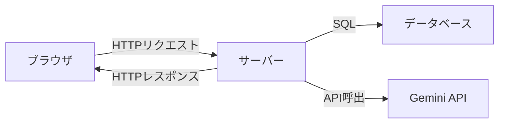
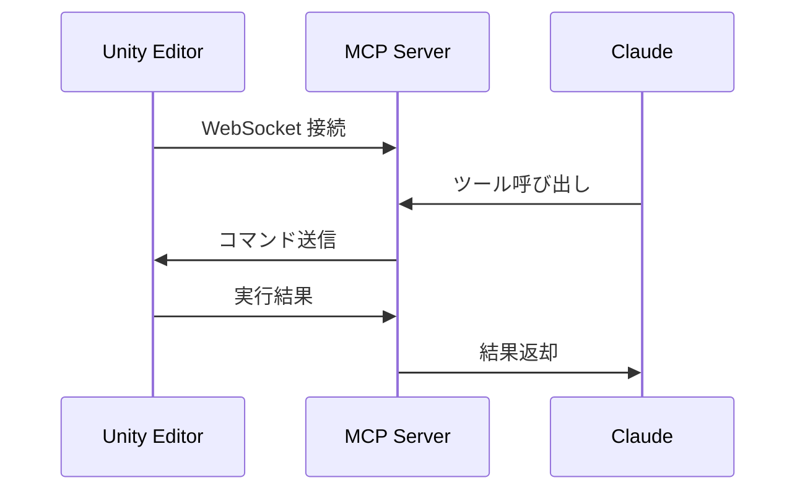

# ネットワークと HTTP

ブラウザで URL を開いたとき、裏側で何が起きているかを理解する。

## インターネットの基本構造



### IPアドレスとポート

- **IPアドレス**: コンピュータの住所。`192.168.1.1` や `127.0.0.1`（自分自身 = localhost）
- **ポート**: そのコンピュータ上のどのサービスか。`:8000` や `:5173`

自分のプロジェクトでの実例:

| サービス | アドレス | 役割 |
|---------|---------|------|
| FastAPI | `localhost:8000` | バックエンド API |
| Vite | `localhost:5173` | フロントエンド開発サーバー |
| MkDocs | `localhost:8080` | ドキュメントプレビュー |

### DNS

`rule-scribe-games.vercel.app` → `76.76.21.21` のような名前解決を行う。
人間は「名前」で覚え、コンピュータは「番号」で通信する。

## HTTP リクエストとレスポンス

### リクエストの構造

```
GET /api/games?q=カタン HTTP/1.1
Host: rule-scribe-games.vercel.app
Accept: application/json
```

| 要素 | 意味 |
|------|------|
| `GET` | メソッド（何をしたいか） |
| `/api/games?q=カタン` | パス + クエリパラメータ |
| `Host` | どのサーバーか |
| `Accept` | 欲しいデータ形式 |

### HTTPメソッド

| メソッド | 用途 | 自分のコードの例 |
|---------|------|----------------|
| `GET` | データ取得 | ゲーム一覧、ゲーム詳細 |
| `POST` | データ作成 | ゲーム新規追加 |
| `PUT` | データ更新 | ゲーム情報の更新 |
| `DELETE` | データ削除 | ゲーム削除 |

### レスポンスの構造

```
HTTP/1.1 200 OK
Content-Type: application/json

{"title": "カタン", "summary": "..."}
```

### ステータスコード

| コード | 意味 | 遭遇する場面 |
|--------|------|-------------|
| `200` | 成功 | 正常なレスポンス |
| `201` | 作成成功 | POST でデータ作成 |
| `400` | 不正なリクエスト | パラメータが間違っている |
| `404` | 見つからない | 存在しないゲームの slug |
| `500` | サーバーエラー | バグやサーバー障害 |

## REST API

### 設計規約

URL の設計パターン。`rule-scribe-games` の実例:

```
GET    /api/games          → ゲーム一覧
GET    /api/games?q=カタン  → 検索
GET    /api/games/catan    → 特定ゲーム（slugで指定）
POST   /api/games/generate → AI生成
GET    /api/health         → ヘルスチェック
```

### FastAPI での実装

```python
from fastapi import FastAPI

app = FastAPI(title="RuleScribe Minimal", version="1.0.0")

@app.get("/health")
def health_check():
    return {"status": "ok"}

@app.get("/games/{slug}")
def game_seo_page(slug: str):
    content = generate_seo_html(slug)
    return HTMLResponse(content=content)
```

- `@app.get("/health")` = 「GET `/health` に対して `health_check` 関数を呼べ」
- `{slug}` = **パスパラメータ**。URL の一部を変数として受け取る

## CORS（クロスオリジン）

フロントエンド（`localhost:5173`）からバックエンド（`localhost:8000`）にアクセスするとき、ブラウザがセキュリティのためにブロックする仕組み。

```python
app.add_middleware(
    CORSMiddleware,
    allow_origins=["*"],
    allow_credentials=False,
    allow_methods=["*"],
    allow_headers=["*"],
)
```

`allow_origins=["*"]` = すべてのオリジンを許可（開発時は便利、本番は要制限）。

## WebSocket

HTTP は「1回のリクエストに1回のレスポンス」。WebSocket は**常時接続**。



`UnityMCP-VRC` ではこの仕組みで AI が Unity Editor をリアルタイム操作する。

| 通信方式 | 向き | 用途 |
|---------|------|------|
| HTTP | 一方向（リクエスト→レスポンス） | API呼び出し |
| WebSocket | 双方向（常時接続） | リアルタイム通信 |

## 演習

### 問1: リクエストを読め

以下のリクエストが何をしているか説明せよ。

```
POST /api/games/generate HTTP/1.1
Host: localhost:8000
Content-Type: application/json

{"query": "ドミニオン"}
```

??? note "解答"
    - メソッド: `POST`（データ作成）
    - パス: `/api/games/generate`（ゲーム生成エンドポイント）
    - ボディ: `{"query": "ドミニオン"}`（ドミニオンというゲームのデータを AI 生成する）
    - ホスト: `localhost:8000`（ローカル開発環境の FastAPI サーバー）

### 問2: ステータスコード

`/api/games/nonexistent-game` にアクセスしたとき、適切なステータスコードは？

??? note "解答"
    `404 Not Found`。存在しない slug でゲームが見つからない場合。

## チェックリスト

- [ ] IP アドレスとポート番号の役割を説明できる
- [ ] HTTP メソッド（GET, POST, PUT, DELETE）を使い分けられる
- [ ] ステータスコード 200, 404, 500 の意味を即答できる
- [ ] REST API の URL 設計の基本規約を知っている
- [ ] HTTP と WebSocket の違いを説明できる
