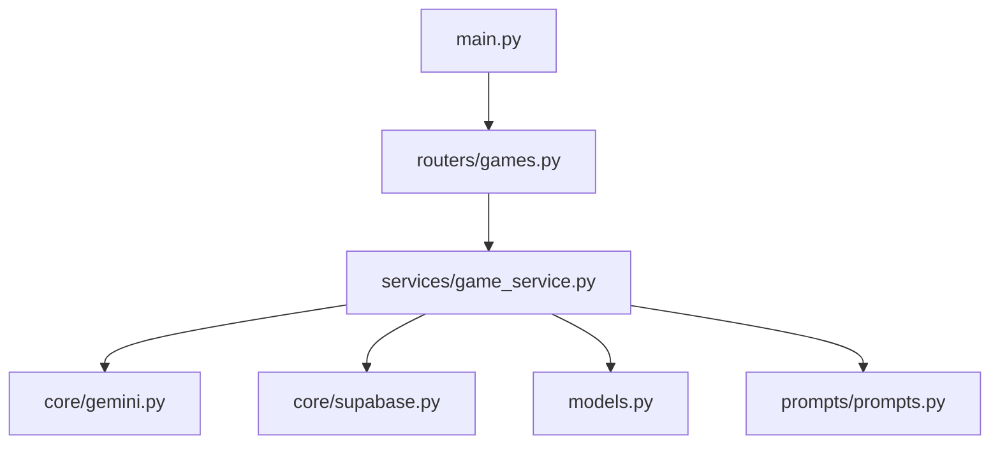

# プログラムの構造

コードを「読める」ようになるための、構造の基礎。

## 関数 — 処理のまとまり

関数は「入力を受け取り、処理して、出力を返す」箱。

```python
def add(a: int, b: int) -> int:
    return a + b
```


### 自分のコードの実例

`rule-scribe-games/app/services/game_service.py`:

```python
def _load_prompt(key: str) -> str:
    data = PROMPTS
    for part in key.split("."):
        data = data[part]
    return str(data).strip()
```

**分解**:

1. **入力**: `key: str` — `"metadata_generator.generate"` のようなドット区切り文字列
2. **処理**: ドットで分割し、辞書を順にたどる
3. **出力**: `-> str` — プロンプトの文字列

### なぜ関数に分けるか

| 原則 | 意味 |
|------|------|
| **単一責任** | 1つの関数は1つのことだけする |
| **再利用** | 同じ処理を何度も書かない |
| **テスト容易性** | 小さい関数は単独でテストできる |

## 同期と非同期

### 同期処理（ふつうの処理）

```python
def make_coffee():
    boil_water()      # 3分待つ
    grind_beans()     # 1分待つ
    brew()            # 2分待つ
    return coffee     # 合計6分
```

### 非同期処理（async/await）

```python
async def make_coffee():
    water_task = boil_water()   # 開始だけして次へ
    beans_task = grind_beans()  # 同時に開始
    water = await water_task    # 完了を待つ
    beans = await beans_task    # すでに完了しているかも
    return brew(water, beans)   # 合計3分（並行実行）
```

**自分のコードの実例**: FastAPI のルーターは `async def` で定義されている。

```python
async def generate_metadata(query: str, context: str | None = None) -> dict[str, object]:
    ...
    result = await _gemini.generate_structured_json(prompt)
    ...
```

`await` = 「AIの応答が来るまで待っている間、他のリクエストを処理できる」

## クラス — データと処理のまとまり

```python
class GameService:
    async def search_games(self, query: str) -> list[dict[str, object]]:
        return await supabase.search(query)

    async def get_game_by_slug(self, slug: str) -> dict[str, object] | None:
        game = await supabase.get_by_slug(slug)
        if game:
            await supabase.increment_view_count(str(game["id"]))
        return game
```

**クラスの役割**: 関連する操作をグループ化する。`GameService` は「ゲームに関する操作」をまとめたもの。

### いつクラスを使うか

| 場面 | 推奨 |
|------|------|
| 状態を持たない処理 | 関数 |
| 関連する操作のグループ | クラス |
| データの定義 | Pydantic / dataclass |

## モジュールとインポート

### ファイル = モジュール

Python では1つの `.py` ファイルが1つのモジュール。

```
app/
├── main.py           # エントリポイント
├── models.py         # データ定義
├── core/
│   ├── gemini.py     # AI 連携
│   ├── supabase.py   # DB 連携
│   └── logger.py     # ログ
├── services/
│   └── game_service.py  # ビジネスロジック
├── routers/
│   └── games.py      # HTTP エンドポイント
└── prompts/
    └── prompts.py    # AI プロンプト
```

### インポートの読み方

```python
from app.core import logger, supabase
from app.core.gemini import GeminiClient
from app.models import GeneratedGameMetadata
from app.prompts.prompts import PROMPTS
```

**読み方**: `from パッケージ.モジュール import 名前`



### 依存の方向

上のグラフの矢印は**依存の方向**を示す。

- `main.py` → `routers` → `services` → `core` の順に依存が深くなる
- `core` は他のモジュールに依存しない（最下層）
- これを**レイヤードアーキテクチャ**と呼ぶ

## 制御フロー

### 条件分岐

```python
game = await supabase.get_by_slug(slug)
if not game:
    return {}
```

Zero-Fat では分岐を最小限にする。「見つからなければ即 return」= **ガード節**。

### ループ

```python
data = {k: v for k, v in data.items() if k in _ALLOWED_FIELDS}
```

これは**辞書内包表記**。以下と同じ意味:

```python
filtered = {}
for k, v in data.items():
    if k in _ALLOWED_FIELDS:
        filtered[k] = v
data = filtered
```

内包表記は1行で書けるが、複雑になったら普通のループに戻す。

## 演習

### 問1: 依存グラフを描け

以下のインポートから依存関係を特定せよ。

```python
from app.core.gemini import GeminiClient
from app.models import GeneratedGameMetadata
```

このファイルはどの層に属するか？

??? note "解答"
    `core`（最下層）と `models` に依存している → **services 層**に属する。
    `main.py` や `routers` には依存していないので、それらより下。

### 問2: 同期 vs 非同期

以下の処理を `async/await` で書き直し、実行時間を見積もれ。

```python
def process():
    a = slow_task_a()   # 3秒
    b = slow_task_b()   # 2秒
    c = slow_task_c()   # 4秒
    return a + b + c     # 合計9秒
```

??? note "解答"
    ```python
    import asyncio

    async def process():
        a, b, c = await asyncio.gather(
            slow_task_a(),
            slow_task_b(),
            slow_task_c(),
        )
        return a + b + c  # 合計4秒（最も遅いタスクに律速）
    ```

## チェックリスト

- [ ] 関数の「入力・処理・出力」を説明できる
- [ ] `async/await` がなぜ必要かを日常の例えで説明できる
- [ ] インポート文を読んでモジュール間の依存関係を把握できる
- [ ] ガード節と内包表記のパターンを認識できる
