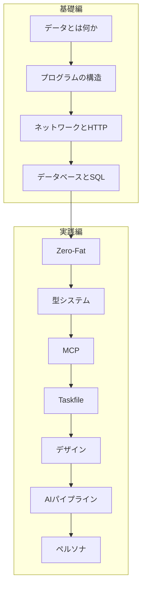

# DeepDive — 実践情報処理

自分のコードベースを教材にした、情報処理スキル向上カリキュラム。

!!! info "このセクションについて"
    抽象的な教科書ではなく、実際に動いているプロジェクトのコードパターンから学ぶ。
    **基礎編**で情報処理の土台を固め、**実践編**で自分のコードに応用する。

## カリキュラム

### 基礎編 — 情報処理の土台

まずはここから。プログラミングの根底にある概念を、自分のコードの実例と対応させて学ぶ。

| # | モジュール | 学ぶこと |
|---|-----------|---------|
| 0-1 | [データとは何か](foundations/data.md) | ビット、型、エンコーディング、JSON |
| 0-2 | [プログラムの構造](foundations/structure.md) | 関数、クラス、モジュール、依存関係 |
| 0-3 | [ネットワークとHTTP](foundations/network.md) | TCP/IP、HTTPリクエスト、REST API |
| 0-4 | [データベースとSQL](foundations/database.md) | テーブル、CRUD、Supabase |

### 実践編 — 自分のコードで深掘り

基礎を理解したら、実際のプロジェクトのパターンへ。

| # | モジュール | 主な題材 | 学べる技術 |
|---|-----------|---------|-----------|
| 1 | [Zero-Fat設計論](zero-fat.md) | `rule-scribe-games`, `pyproject.toml` | Ruff, Fail-Fast |
| 2 | [型システムと契約](typing.md) | `app/models.py` | Pydantic, 型ヒント |
| 3 | [MCPエコシステム](mcp.md) | `UnityMCP-VRC` | WebSocket, MCP |
| 4 | [Taskfile & uv](workflow.md) | ルート `Taskfile.yml` | タスクランナー |
| 5 | [デザイントークン](design.md) | `frontend/src/index.css` | CSS Variables |
| 6 | [AIパイプライン](ai-pipeline.md) | `yt3`, `daily-arXiv` | LangGraph, Gemini |
| 7 | [AIペルソナ品質管理](persona.md) | `furuyoni` | AGENTS.md, ペルソナ |

## 学び方

順番通りに進めても、興味のあるモジュールだけ飛ばし読みしてもよい。
