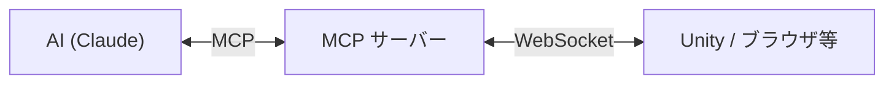
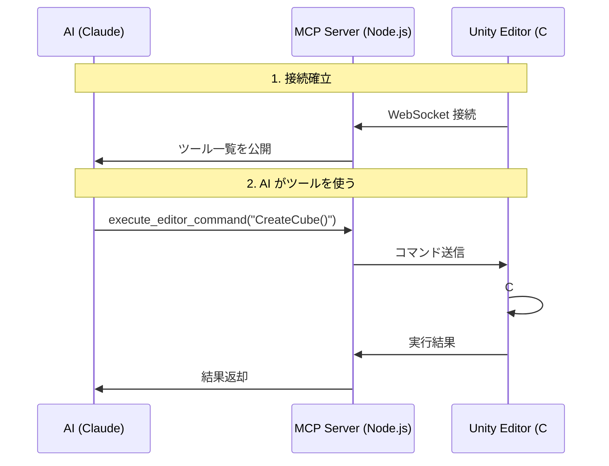

# MCP エコシステム

Model Context Protocol（MCP）は、AI にツールを提供するための標準規格。

## MCP とは何か



**従来**: AI はテキストの入出力しかできない
**MCP**: AI が「ツール」を呼び出して外部システムを操作できる

### 身近な例え

| 概念 | 人間の世界 | MCP の世界 |
|------|-----------|-----------|
| ツール | ハンマー、ドライバー | `execute_editor_command`, `get_editor_state` |
| リソース | 設計図、マニュアル | `editor://state`, `editor://logs` |
| サーバー | 工具棚 | `unity-mcp-server` |

## UnityMCP-VRC のアーキテクチャ



### ディレクトリ構造

```
unity-mcp-server/src/
├── index.ts              # エントリポイント
├── communication/        # WebSocket 接続管理
├── tools/                # AI に公開するツール
│   ├── execute_editor_command.ts
│   ├── get_editor_state.ts
│   └── ...
└── resources/            # AI に公開するデータ
    ├── editor_state.ts
    ├── editor_logs.ts
    └── ...
```

### ツールの定義パターン

```typescript
{
  name: "execute_editor_command",
  description: "Unity Editor 内で C# コードを実行する",
  inputSchema: {
    type: "object",
    properties: {
      code: { type: "string", description: "実行する C# コード" }
    },
    required: ["code"]
  }
}
```

**構造**: 名前 + 説明 + 入力スキーマ。AI はこの情報だけでツールの使い方を判断する。

## MCP の設計原則

### ツール vs リソース

| 種類 | 性質 | 例 |
|------|------|-----|
| ツール | 副作用あり（何かを変更する） | コマンド実行、ファイル作成 |
| リソース | 読み取り専用 | エディタ状態、ログ取得 |

### 良いツール設計

| 原則 | OK | NG |
|------|-----|-----|
| 単一責任 | `create_cube()` | `create_cube_and_set_color_and_add_script()` |
| 明確な命名 | `get_editor_state` | `do_thing` |
| 型付き引数 | `code: string` | `args: any` |

## 動的 C# 実行

Unity プラグインは受け取った C# コードを**メモリ内でコンパイルして実行**する。

```csharp
public class EditorCommand
{
    public static object Execute()
    {
        GameObject cube = GameObject.CreatePrimitive(PrimitiveType.Cube);
        cube.transform.position = new Vector3(0, 1, 0);
        return "Cube created at (0, 1, 0)";
    }
}
```

**制約**: `EditorCommand` クラスの `static object Execute()` メソッドが必須。
この「契約」により、AI が生成するコードの形式が統一される。

## 自分のプロジェクトで使われている MCP

| プロジェクト | MCP の用途 |
|-------------|-----------|
| `UnityMCP-VRC` | AI → Unity Editor の操作 |
| `DeepCode` | `mcp_agent.config.yaml` でのエージェント構成 |
| 全プロジェクト | Claude Desktop / Gemini CLI からのツール利用 |

## チェックリスト

- [ ] MCP のツールとリソースの違いを説明できる
- [ ] WebSocket と HTTP の使い分けを理解している
- [ ] ツール定義に必要な3要素（名前、説明、スキーマ）を挙げられる
- [ ] 動的コード実行のリスクと制約を説明できる
