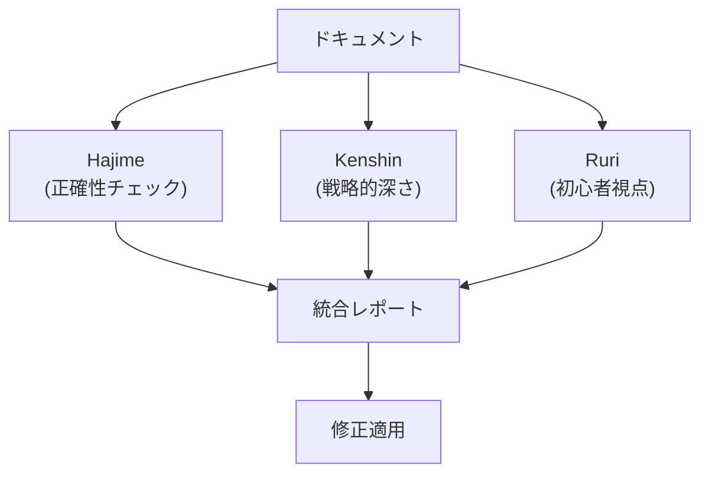
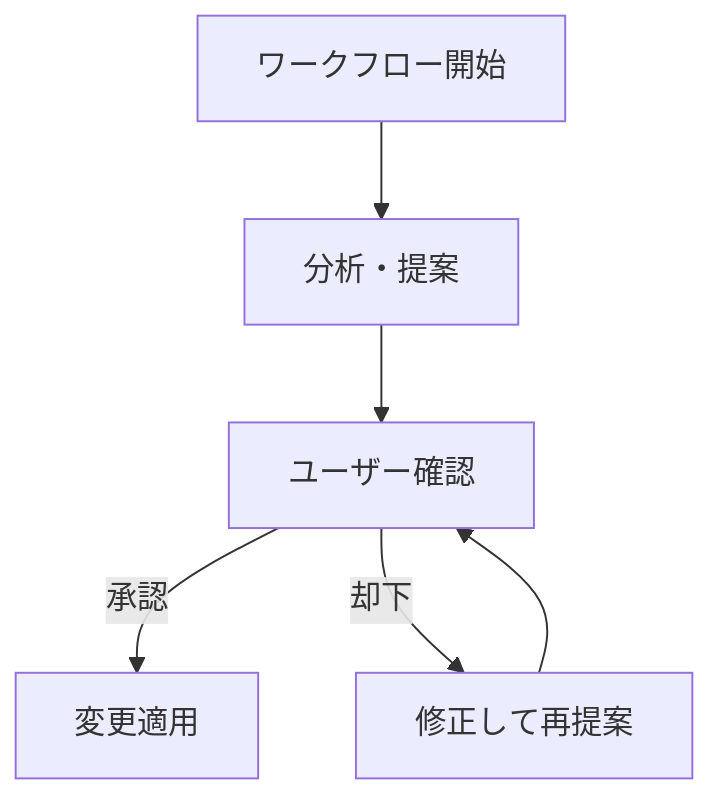

# AI ペルソナと品質管理

AI に「役割」を与えて、コンテンツ品質を体系的に管理する手法。

## なぜペルソナが必要か

AI にただ「レビューして」と言っても:

- 常に肯定的なフィードバック（「よくできています！」）
- 表面的な指摘のみ
- 視点が単一

**ペルソナ**: AI に特定の「人格」と「評価基準」を与え、多角的な品質管理を実現する。

## furuyoni の 3 ペルソナ・レビュー



### 各ペルソナの役割

| ペルソナ | 視点 | チェック項目 |
|---------|------|-------------|
| **Hajime** | 正確性 | 数値の誤り、ルール解釈の矛盾、カード効果の記述ミス |
| **Kenshin** | 戦略性 | 戦術の深さ、メタゲームの考慮、実戦での妥当性 |
| **Ruri** | 初心者 | 用語が難しすぎないか、前提知識が明示されているか |

### 運用ルール

```
忖度なし・称賛禁止
```

AI はデフォルトで「褒める」傾向がある。これを明示的に禁止することで、率直なフィードバックを得る。

## AGENTS.md による行動制御

各プロジェクトの `AGENTS.md` は AI の「取扱説明書」。

### furuyoni の例

```markdown
### コンテンツ監査
- **furuyoni_reviewer**: 既存のドキュメントをレビューする際は、
  必ず「忖度なし・称賛禁止」のペルソナ（Hajime, Kenshin, Ruri）を適用せよ。
- **改善提案**: 単なる指摘に留まらず、常に具体的な修正案を提示せよ。
```

### rule-scribe-games の例

```markdown
### Critical Configuration Rules
> **NEVER change the Gemini model name.** 
> The project strictly enforces `models/gemini-3-flash-preview`.
```

### 設計パターン

| 要素 | 目的 | 例 |
|------|------|-----|
| **禁止事項** | 絶対にやってはいけないこと | モデル名の変更禁止 |
| **必須事項** | 常に実行すべきこと | ペルソナの適用 |
| **ワークフロー** | 手順の定義 | `/review` → レビュー → 修正案生成 |

## AI ワークフローの自動化

### Taskfile との統合

```yaml
agent:review:
    desc: "AI: 3ペルソナによるコンテンツレビュー"

agent:audit:
    desc: "AI: 全ドキュメント横断の一貫性監査"

agent:maintain:
    desc: "AI: メンテナンスタスク一括実行"
    cmds:
      - uv run scripts/maintain.py check-links
      - uv run scripts/maintain.py add-links
      - uv run mkdocs build --strict
```

**人間の操作**: `task agent:maintain` を実行するだけ。
**AI の操作**: チャットで `/maintain` と入力するだけ。

### 自律性と安全性のバランス

```
各ワークフローは破壊的変更の適用前に必ずユーザー承認を求めよ。
```

AI は自律的に作業するが、**変更の適用前に必ず確認を取る**。



## 品質メトリクス

### 自動チェック

| チェック | ツール | 目的 |
|---------|--------|------|
| リンク切れ | `maintain.py check-links` | ナビゲーションの健全性 |
| ビルドエラー | `mkdocs build --strict` | ドキュメントの構文正確性 |
| コード品質 | `ruff check .` | Python コードの一貫性 |

### AI レビュー

| チェック | ペルソナ | 目的 |
|---------|---------|------|
| 事実正確性 | Hajime | 情報の正しさ |
| 深度 | Kenshin | 内容の充実度 |
| 可読性 | Ruri | 読者への配慮 |

## 演習

### 問1: ペルソナを設計せよ

自分のプロジェクトの1つについて、3つの異なるレビューペルソナを設計せよ。

??? note "解答例（RuleScribe の場合）"
    | ペルソナ | 視点 | チェック項目 |
    |---------|------|-------------|
    | **GameMaster** | ルール正確性 | ゲームルールの記述が BGG と一致するか |
    | **SEO審査官** | 検索最適化 | タイトル、メタ、構造化データの品質 |
    | **初心者ゲーマー** | ユーザビリティ | 説明がわかりやすいか、専門用語は説明されているか |

### 問2: AGENTS.md を書け

新しいプロジェクトの AGENTS.md に含めるべき最小限の要素を挙げよ。

??? note "解答"
    1. **プロジェクト構造**: ディレクトリと役割の説明
    2. **必須コマンド**: `task setup`, `task dev`, `task lint`
    3. **禁止事項**: 変更してはいけない設定値
    4. **コーディングスタイル**: 命名規則、インデント、型ヒント
    5. **テスト方法**: どうやって正しさを検証するか

## チェックリスト

- [ ] AI ペルソナの目的と効果を説明できる
- [ ] AGENTS.md の必要最低限の構成要素を挙げられる
- [ ] 自律性と安全性のバランスをどう取るか説明できる
- [ ] 自動チェックと AI レビューの使い分けを理解している
