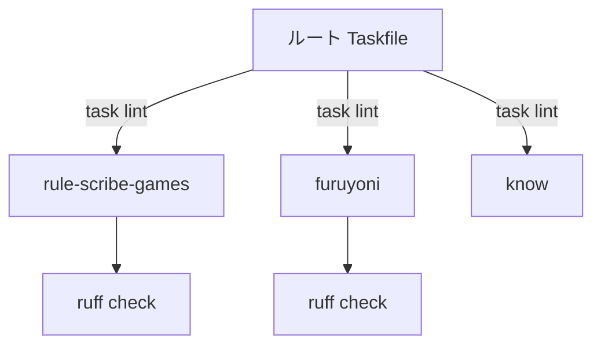

# Taskfile & uv

開発環境の構築と自動化。「1コマンドで何でもできる」を実現する。

## なぜタスクランナーが必要か

```
# タスクランナーなし
$ cd frontend && npm install && cd .. && uv sync && uv run mkdocs build

# タスクランナーあり
$ task setup
```

**問題**: プロジェクトごとにコマンドが違う。覚えきれない。
**解決**: `Taskfile.yml` に全コマンドを集約。`task <名前>` で統一的に実行。

## Taskfile の基本

```yaml
version: '3'

tasks:
  dev:
    desc: Serve docs locally
    cmd: uv run mkdocs serve

  build:
    desc: Build static site
    cmd: uv run mkdocs build

  deploy:
    desc: Deploy to GitHub Pages
    cmd: uv run mkdocs gh-deploy --force
```

| 要素 | 意味 |
|------|------|
| `version: '3'` | Taskfile の構文バージョン |
| `tasks:` | タスクの定義開始 |
| `dev:` | タスク名（`task dev` で実行） |
| `desc:` | 説明文 |
| `cmd:` | 実行するコマンド（単一） |
| `cmds:` | 実行するコマンド（複数、順序実行） |

## ルート Taskfile のパターン

`/home/kafka/projects/Taskfile.yml` は全プロジェクトを横断する:

```yaml
tasks:
  build:all:
    desc: Build all projects
    cmds:
      - for d in *; do [ -f "$d/Taskfile.yml" ] && (cd "$d" && task build); done

  lint:
    desc: Lint workspace and all projects
    cmds:
      - "uv run ruff check . --fix"
      - for d in *; do [ -f "$d/Taskfile.yml" ] && (cd "$d" && task lint); done
```

**設計**: ルートの `task lint` → 各サブプロジェクトの `task lint` を連鎖実行。



## AI ワークフロー・タスク

`furuyoni/Taskfile.yml` の `agent:*` タスクは AI を呼び出す:

```yaml
agent:review:
    desc: "AI: 3ペルソナによるコンテンツレビュー"

agent:audit:
    desc: "AI: 全ドキュメント横断の一貫性監査"

agent:maintain:
    desc: "AI: メンテナンスタスク一括実行"
    cmds:
      - uv run scripts/maintain.py check-links
      - uv run scripts/maintain.py add-links
      - uv run scripts/maintain.py download-assets
      - uv run mkdocs build --strict
```

**ポイント**: AI が実行するワークフローも `Taskfile` で定義する。人間もAIも同じインターフェース。

## uv — 高速パッケージマネージャ

### pip vs uv

| 特性 | pip | uv |
|------|-----|-----|
| 速度 | 遅い（秒単位） | 極めて速い（ミリ秒単位） |
| ロックファイル | なし（`requirements.txt` は手動） | `uv.lock`（自動生成） |
| 仮想環境 | `python -m venv` | `uv venv`（自動作成） |
| 再現性 | 低い | 高い（ロックファイルで固定） |

### 基本コマンド

```bash
uv init .                 # 新規プロジェクト初期化
uv add requests pydantic  # 依存追加
uv sync                   # ロックファイルから環境同期
uv run python script.py   # 仮想環境内で実行
uv run ruff check .       # ツール実行
```

### `pyproject.toml` との連携

```toml
[project]
name = "projects-root"
version = "0.1.0"
requires-python = ">=3.11"
```

`uv` は `pyproject.toml` を読み、依存を `uv.lock` に固定する。
`uv sync` で他の開発者（やAI）が全く同じ環境を再現できる。

## 実際のワークフロー

### プロジェクトのセットアップ

```bash
git clone <repo>
cd <project>
task setup       # uv sync + npm install 等
task dev         # 開発サーバー起動
```

### 日常の開発

```bash
task lint        # コード品質チェック + 自動修正
task format      # フォーマット
task check       # CI と同じチェック
```

### デプロイ

```bash
task deploy      # GitHub Pages / Vercel にデプロイ
```

## 演習

### 問1: Taskfile を読め

以下のタスクが何をするか説明せよ。

```yaml
clean:zerofat:
    cmds:
      - "find . -type f -name '*.py' -exec sed -i 's/^\\s*#.*//' {} +"
      - "find . -type f -name '*.py' -exec sed -i '/^\\s*$/d' {} +"
```

??? note "解答"
    1. すべての `.py` ファイルから、行頭がコメント（`#`）の行を空行に置換
    2. すべての `.py` ファイルから、空行を削除
    → Zero-Fat 原則のコメント+空行削除の自動化

### 問2: uv vs pip

`requirements.txt` を使った環境構築と `uv.lock` を使った環境構築の違いを説明せよ。

??? note "解答"
    - `requirements.txt`: バージョン範囲指定（`requests>=2.28`）→ インストール時期により異なるバージョンが入る
    - `uv.lock`: 正確なバージョン固定（`requests==2.31.0` + 依存全体のハッシュ）→ いつでも同じ環境

## チェックリスト

- [ ] `task <name>` でプロジェクトのタスクを実行できる
- [ ] `Taskfile.yml` の `cmd` と `cmds` の違いを理解している
- [ ] `uv sync` と `uv run` の違いを説明できる
- [ ] ルート Taskfile が子プロジェクトに連鎖する仕組みを理解している
