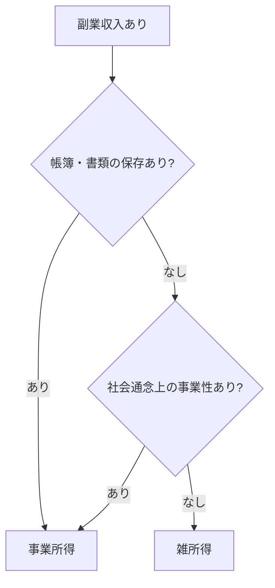

# 副業の税金

副業で得た所得の税務処理。

## 法的根拠

- 所得税法第35条（雑所得）
- 所得税法第27条（事業所得）

## 所得区分（令和4年10月改正通達）

| 区分 | 定義 | 主な特徴 |
|------|------|----------|
| 雑所得 | 他の9種類に該当しない所得 | 帳簿保存なし、副業的な収入 |
| 事業所得 | 事業から生じる所得 | 帳簿保存あり、継続的な営利活動 |

### 判定フローチャート



### 判定基準（MECE）

> [!IMPORTANT]
> **帳簿保存の有無**が最重要基準。収入300万円は判定基準ではない。

| ケース | 帳簿保存 | 社会通念上の事業性 | 所得区分 |
|--------|----------|-------------------|----------|
| A | **あり** | - | **事業所得** |
| B | なし | **あり** | **事業所得** |
| C | なし | なし | **雑所得** |

> [!NOTE]
> ケースB（帳簿なし＋事業性あり）は現実には稀。帳簿を作成すればケースAに移行可能。

### 帳簿保存義務（雑所得）

| 前々年の収入金額 | 義務 |
|------------------|------|
| 300万円超 | 現金預金取引等関係書類を**5年間保存** |
| 1,000万円超 | 確定申告書に**収支内訳書を添付** |

## 税率

| 税目 | 税率 |
|------|------|
| 所得税 | 5%〜45%（累進課税）+ 復興特別所得税2.1% |
| 住民税 | 10%（都道府県4% + 市区町村6%） |

## 計算方法

```
雑所得 = 総収入金額 − 必要経費
```

### 必要経費（所得税法第37条）

収入を得るために直接必要な支出:

| 項目 | 例 |
|------|-----|
| 消耗品費 | PC、周辺機器（10万円未満） |
| 通信費 | インターネット、携帯電話 |
| 新聞図書費 | 業務関連書籍 |
| 旅費交通費 | 業務関連の移動費 |

> ⚠️ 家事按分が必要。私用と業務の使用割合で按分。

## 20万円ルール

| 給与所得以外の所得 | 所得税の確定申告 | 住民税の申告 |
|---------------------|------------------|--------------|
| 20万円以下 | 不要 | **必要** |
| 20万円超 | **必要** | **必要** |

> ⚠️ 医療費控除・ふるさと納税で確定申告する場合、20万円以下でも申告必須

## 参照（国税庁公式）

- [No.1500 雑所得](https://www.nta.go.jp/taxes/shiraberu/taxanswer/shotoku/1500.htm)
- [No.2210 やさしい必要経費の知識](https://www.nta.go.jp/taxes/shiraberu/taxanswer/shotoku/2210.htm)
- [副業収入の所得区分](https://www.nta.go.jp/taxes/shiraberu/shinkoku/kakutei/2022/b/01/01-1.pdf)
