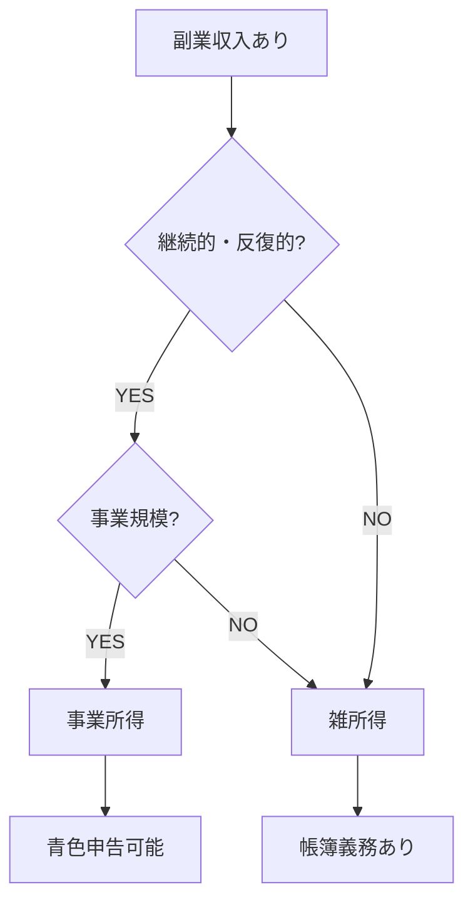
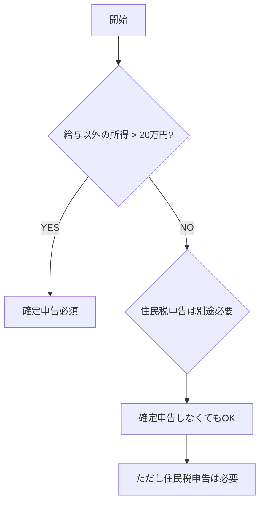

# 給与所得者×投資×副業の確定申告

会社員で特定口座（源泉徴収あり）の投資収益 + 副業収入がある場合の判定フロー。

## 前提条件

| 項目 | 内容 |
|------|------|
| 雇用形態 | 会社員（フルタイム） |
| 給与収入 | 2,000万円以下 |
| 口座 | 特定口座（源泉徴収あり） |
| 副業 | 雑所得 or 事業所得 |

## 副業所得の分類



| 所得区分 | 要件 | メリット |
|----------|------|----------|
| 事業所得 | 継続・反復・独立 | 青色申告特別控除（最大65万円） |
| 雑所得 | 上記以外 | 手続きが簡易 |

## 確定申告の要否



> [!IMPORTANT]
> 副業所得が20万円以下でも**住民税の申告は必要**。

## ケース別対応

### 1. 副業20万円超 + 投資益あり

| 項目 | 対応 |
|------|------|
| 確定申告 | **必須** |
| 投資 | 申告分離課税として一緒に申告 |
| 損益通算 | 複数口座の通算が可能 |

### 2. 副業20万円超 + 投資損あり

| 項目 | 対応 |
|------|------|
| 確定申告 | **必須** |
| 投資損失 | 繰越控除の申告も同時に |

### 3. 副業20万円以下 + 投資損あり

| 項目 | 対応 |
|------|------|
| 確定申告 | 任意（損失繰越したい場合は申告） |
| 住民税 | 別途申告必要 |

## 計算シート

### 入力

| 項目 | 金額 |
|------|------|
| 給与収入 | _____ 円 |
| 副業収入 | _____ 円 |
| 副業経費 | _____ 円 |
| 株式譲渡益 | _____ 円 |
| 株式譲渡損 | _____ 円 |
| 配当 | _____ 円 |

### 判定

**Step 1: 副業所得の計算**
```
副業所得 = 副業収入 − 副業経費
```

**Step 2: 申告要否判定**
```
副業所得 > 200,000 → 確定申告必須
副業所得 ≤ 200,000 → 住民税申告のみ
```

**Step 3: 総所得金額**
```
総所得 = 給与所得 + 副業所得
（投資は分離課税のため加算しない）
```

## 副業の経費例

| カテゴリ | 例 |
|----------|-----|
| 通信費 | インターネット、電話（按分） |
| 消耗品費 | PC、文房具 |
| 外注費 | 外部委託費 |
| 旅費交通費 | 打ち合わせ移動費 |
| 図書費 | 専門書籍 |

## 注意事項

> [!CAUTION]
> - 会社の就業規則で副業禁止の場合あり
> - 住民税を「普通徴収」にしないと会社に副業がバレる可能性
> - 確定申告書の「住民税に関する事項」で**自分で納付**を選択

## 必要書類

| 書類 | 入手先 |
|------|--------|
| 源泉徴収票 | 勤務先 |
| 年間取引報告書 | 証券会社 |
| 副業の収支内訳 | 自分で作成 |
| 経費の領収書 | 保管分 |

## 参照

- [No.1900 給与所得者で確定申告が必要な人](https://www.nta.go.jp/taxes/shiraberu/taxanswer/shotoku/1900.htm)
- [No.1500 雑所得](https://www.nta.go.jp/taxes/shiraberu/taxanswer/shotoku/1500.htm)
- [No.2070 青色申告制度](https://www.nta.go.jp/taxes/shiraberu/taxanswer/shotoku/2070.htm)
