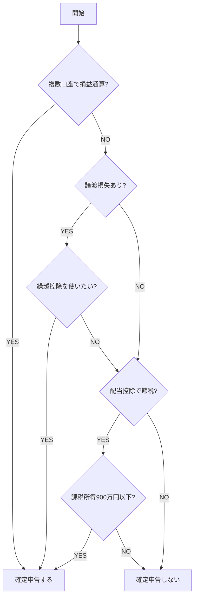

# 給与所得者×投資（特定口座）の確定申告

会社員で特定口座（源泉徴収あり）の投資収益・配当がある場合の判定フロー。

## 前提条件

| 項目 | 内容 |
|------|------|
| 雇用形態 | 会社員（フルタイム） |
| 給与収入 | 2,000万円以下 |
| 口座 | 特定口座（源泉徴収あり） |
| 収益 | 株式譲渡益 + 配当 |

## 確定申告の判定



## ケース別対応

### 1. 複数口座で損益通算

| 状態 | 対応 |
|------|------|
| A証券: +50万、B証券: -30万 | 申告で源泉徴収済み税金の還付 |

```
還付額 = 300,000 × 20.315% = 60,945円
```

### 2. 譲渡損失の繰越控除

損失が発生した年に申告 → 翌年以降3年間繰越可能。

| 年 | 損益 | 繰越損失 | 課税所得 |
|----|------|----------|----------|
| 2025年 | -100万 | 100万 | 0円 |
| 2026年 | +40万 | 60万 | 0円 |
| 2027年 | +40万 | 20万 | 0円 |
| 2028年 | +40万 | 0円 | 20万 |

### 3. 配当控除（総合課税）

**課税所得別の有利判定:**

| 課税所得 | 総合課税 | 申告分離/不要 | 判定 |
|----------|----------|---------------|------|
| 330万円以下 | 所得税0% | 15.315% | ✅ 総合課税 |
| 695万円以下 | 所得税10% | 15.315% | ✅ 総合課税 |
| 900万円以下 | 所得税13% | 15.315% | △ ほぼ同等 |
| 900万円超 | 所得税23%〜 | 15.315% | ❌ 申告不要 |

## 計算シート

### 入力

| 項目 | 金額 |
|------|------|
| 給与収入 | _____ 円 |
| 株式譲渡益 | _____ 円 |
| 株式譲渡損 | _____ 円 |
| 配当 | _____ 円 |
| 源泉徴収済み税額 | _____ 円 |

### 判定

**Step 1: 損益通算**
```
通算後所得 = 譲渡益 − 譲渡損 + 配当
```

**Step 2: 還付可能額**
```
還付額 = 源泉徴収済み − (通算後所得 × 20.315%)
```

**Step 3: 配当控除シミュレーション**
```
総合課税の場合:
  所得税 = 配当 × (累進税率 − 配当控除率)
  住民税 = 配当 × (10% − 2.8%)

申告不要の場合:
  税額 = 配当 × 20.315%
```

## 注意事項

> [!CAUTION]
> 確定申告すると**合計所得金額**に算入される。
> - 扶養控除・配偶者控除の判定に影響
> - 国民健康保険料が増加する可能性

## 必要書類

| 書類 | 入手先 |
|------|--------|
| 源泉徴収票 | 勤務先 |
| 年間取引報告書 | 証券会社 |
| 配当金の支払通知書 | 証券会社 |

## 申告手順

1. [確定申告書等作成コーナー](https://www.keisan.nta.go.jp/kyoutu/ky/sm/top)にアクセス
2. 「所得税」→「作成開始」
3. 給与所得を入力（源泉徴収票から）
4. 「株式等の譲渡所得等」を選択
5. 年間取引報告書の内容を入力
6. 配当所得を入力（課税方式を選択）
7. 還付金額を確認
8. e-Taxで送信 or 印刷して郵送

## 参照

- [No.1476 特定口座制度](https://www.nta.go.jp/taxes/shiraberu/taxanswer/shotoku/1476.htm)
- [No.1474 損益通算及び繰越控除](https://www.nta.go.jp/taxes/shiraberu/taxanswer/shotoku/1474.htm)
- [No.1250 配当所得](https://www.nta.go.jp/taxes/shiraberu/taxanswer/shotoku/1250.htm)
